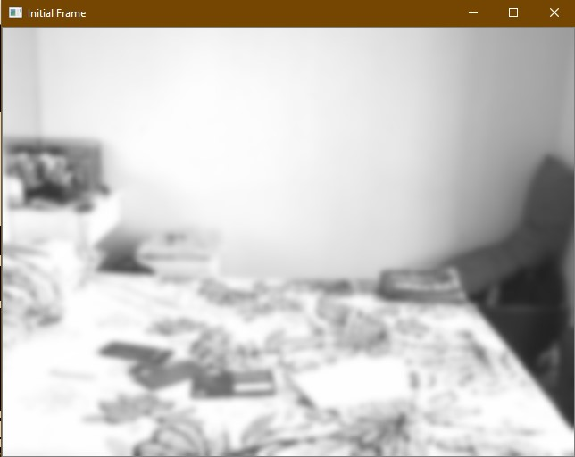
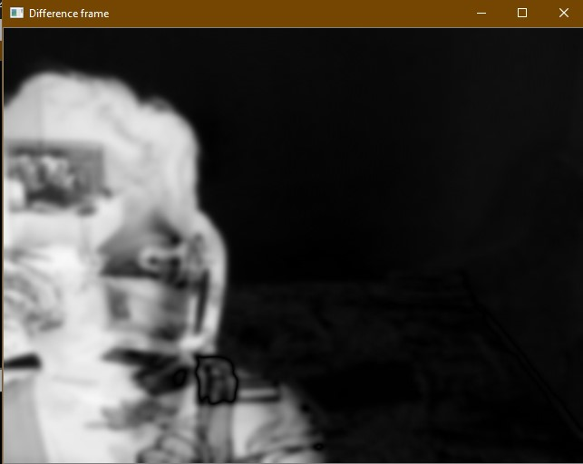
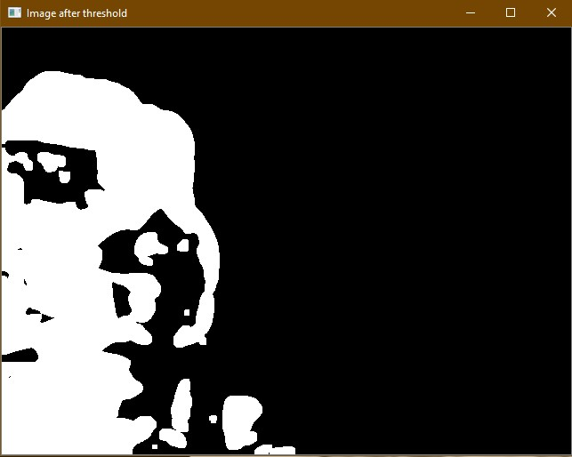
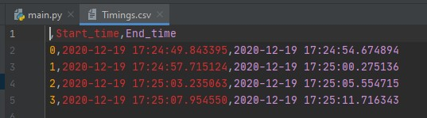

# Motion-Detector
Motion Detector using opencv which is able to detect a moving object in a static background and record the time of entrance and exit

# Description

1. First capture the static background of your frame without any moving bodies

2. Now, the static background will be used to calculate the difference between the static background and the subsquent frames to produce the difference images as show

3. Now the difference image is threshold with a certain value to produce a binary image and detect the contours based on its area

4. A moving object is detected when contour area is > 10000 and the time of its entrance and exit is appended into a dataframe

5. This dataframe is then exported as csv for referece

